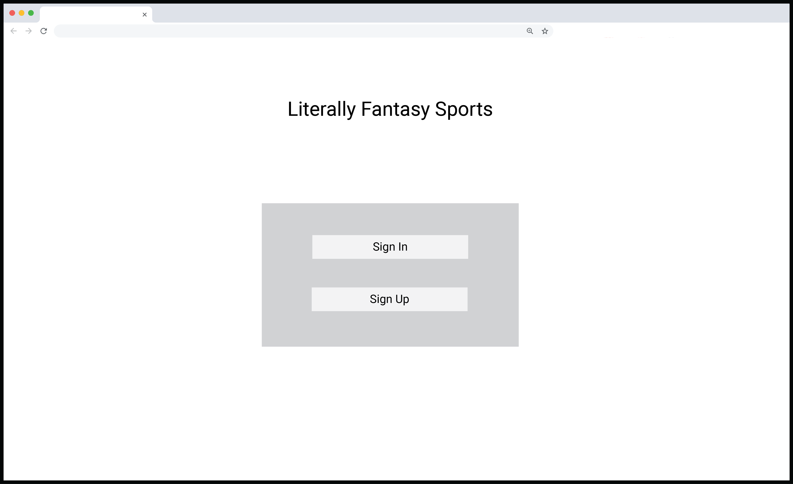
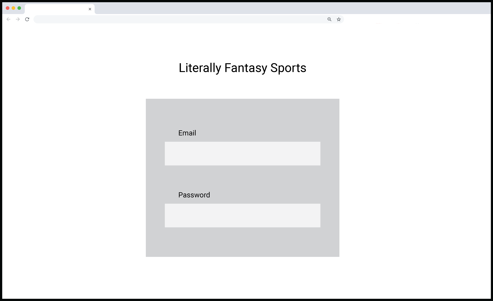

# The Literally Fantasy Sports Dev Bible

This is the hub for all information pertaining to the development of Literally Fantasy Sports. A very quick, 'proof-of-concept' project can be found [here](https://literallyfantasysports.herokuapp.com).

## Index

+ [User Stories](#user-stories)
+ [Features](https://github.com/mharr171/The-Literally-Fantasy-Sports-Dev-Bible/blob/master/pages/features.md)
+ [Models](https://github.com/mharr171/The-Literally-Fantasy-Sports-Dev-Bible/blob/master/pages/models.md)
+ [Match Engine](https://github.com/mharr171/The-Literally-Fantasy-Sports-Dev-Bible/blob/master/pages/match_engine.md)&dagger;
+ [Game
Engine](https://github.com/mharr171/The-Literally-Fantasy-Sports-Dev-Bible/blob/master/pages/game_engine.md)&dagger;

&dagger;Match Engine pertains to the engine that runs the matches (contests between two teams). Game Engine pertains to the engine that runs Literally Fantasy Sports as a complete unit.

## User Stories

User stories related to the application but not particularly with the game or match engine. Those other user stories can be found in [Game Engine User Stories](https://github.com/mharr171/The-Literally-Fantasy-Sports-Dev-Bible/blob/master/pages/game_engine.md#user-stories) and [Match Engine User Stories](https://github.com/mharr171/The-Literally-Fantasy-Sports-Dev-Bible/blob/master/pages/match_engine.md#user-stories).

| As a... | I want... | Difficulty |
| ---:| --- |:---:|
| User |  | 0 |
| Admin |  | 0 |

## Wireframes

### Main Splash

What users will see when initially visiting the site. (pre-alpha) 

### Main Login

Basic login view.

