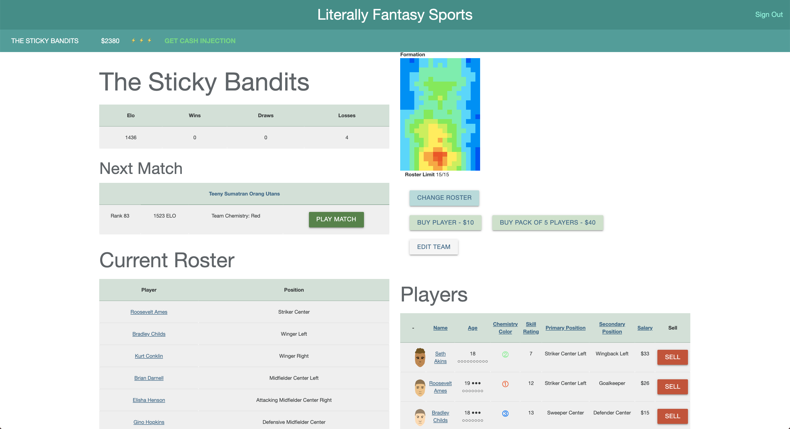

# The Literally Fantasy Sports Dev Bible



This is the hub for all information pertaining to the development of Literally Fantasy Sports
A very quick, 'proof-of-concept' project can be found [here](https://literallyfantasysports.herokuapp.com).

</br>
</br>
</br>

___

</br>
</br>
</br>

## Index

+ [Features](#features)
+ [Models](#models)
+ [Functions](#functions)
+ [Notes](#notes)

</br>
</br>
</br>

[Top](#the-literally-fantasy-sports-dev-bible)

___

</br>
</br>
</br>

## Features

### Features Index

+ [Pre-Alpha Features List](#pre-alpha-features-list)
+ [Future Features List](#future-features-list)
+ [Features In-Depth](#features-in-depth)

### Pre-Alpha Features List

+ [Player Trait System](#player-trait-system)
+ [Player Face System](#player-face-system)
+ [Training System](#training-system)
+ [Trading System](#trading-system)
+ [Home/Away Crowd Attendance](#home-away-crowd-attendance)
+ [Ratings Based Tournament/Season Play](#ratings-based-tournament-season-play)
+ [Social (Guild) System / Create-A-League](#social-guild-system-create-a-league)
+ 

### Future Features List

+ [Farm Systems / Multiple Teams](#farm-systems-multiple-teams)
+ 

### Features In-Depth

##### Player Trait System


##### Player Face System


##### Training System


##### Trading System


##### Home/Away Crowd Attendance


##### Ratings Based Tournament/Season Play


##### Social (Guild) System / Create-A-League


##### Farm Systems / Multiple Teams


</br>
</br>
</br>

[Features Index](#features-index) • [Top](#the-literally-fantasy-sports-dev-bible)

___

</br>
</br>
</br>

## Models

### Models Index

+ [User](#user-model)
+ [Team](#team-model)
+ [Player](#player-model)
+ [League](#league-model)

### User Model

+ [User Functions](#user-functions)
+ [User Notes](#user-notes)

#### Data

| Name | Datatype | Description |
| ---:|:---:| --- |
| email | string | Used for logging in |
| password | string | Used for logging in |
| manager_name | string | Used to address the user in-game and displayed on profile page |

####  Relationships

```ruby
has_many :teams
has_many :players
```

### Team Model

+ [Team Functions](#team-functions)
+ [Team Notes](#team-notes)

#### Data

| Name | Datatype | Description |
| ---:|:---:| --- |
| team_name | string | The name of team. Used on team profile page and leaderboards |

####  Relationships

```ruby
```

### Player Model

+ [Player Functions](#player-functions)
+ [Player Notes](#player-notes)

#### Data

| Name | Datatype | Description |
| ---:|:---:| --- |
|  |  |  |

####  Relationships

```ruby
```

### League Model

+ [League functions](#league-functions)
+ [League Notes](#league-notes)

#### Data

| Name | Datatype | Description |
| ---:|:---:| --- |
|  |  |  |

####  Relationships

```ruby
```

</br>
</br>
</br>

[Models Index](#models-index) • [Top](#the-literally-fantasy-sports-dev-bible)

___

</br>
</br>
</br>

## Functions


### Functions Index

+ [User](#user-functions)
+ [Team](#team-functions)
+ [Player](#player-functions)
+ [League](#league-functions)

### User Functions

User can...

+ Sign up
+ Log in
+ Log Out

### Team Functions

User can...

+ Create Team <sup>[&dagger;<sup>1</sup>](#team-notes)</sup>
+ Rename Team
+ Dissolve Team

### Player Functions

User can...

+ <sub>[ INCOMPLETE ]</sub>

### League Functions

User can...

+ <sub>[ INCOMPLETE ]</sub>

</br>
</br>
</br>

[Functions Index](#functions-index) • [Top](#the-literally-fantasy-sports-dev-bible)

___

</br>
</br>
</br>

## Notes

### Notes Index

+ [User](#user-notes)
+ [Team](#team-notes)
+ [Player](#player-notes)
+ [League](#league-notes)


### User Notes


### Team Notes

<sup>1</sup> One future feature will be that users of sufficient income or notoriety will be able to control multiple teams, creating a farm system for their dynasty.

### Player Notes


### League Notes


</br>
</br>
</br>

[Notes Index](#notes-index) • [Top](#the-literally-fantasy-sports-dev-bible)

___

</br>
</br>
</br>