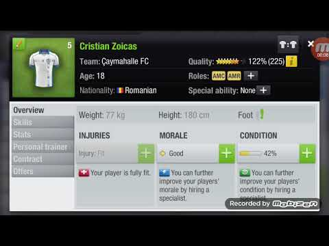
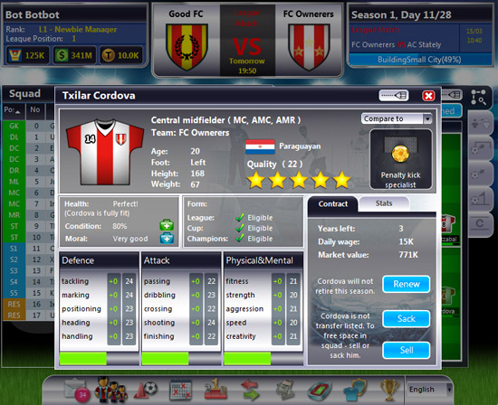
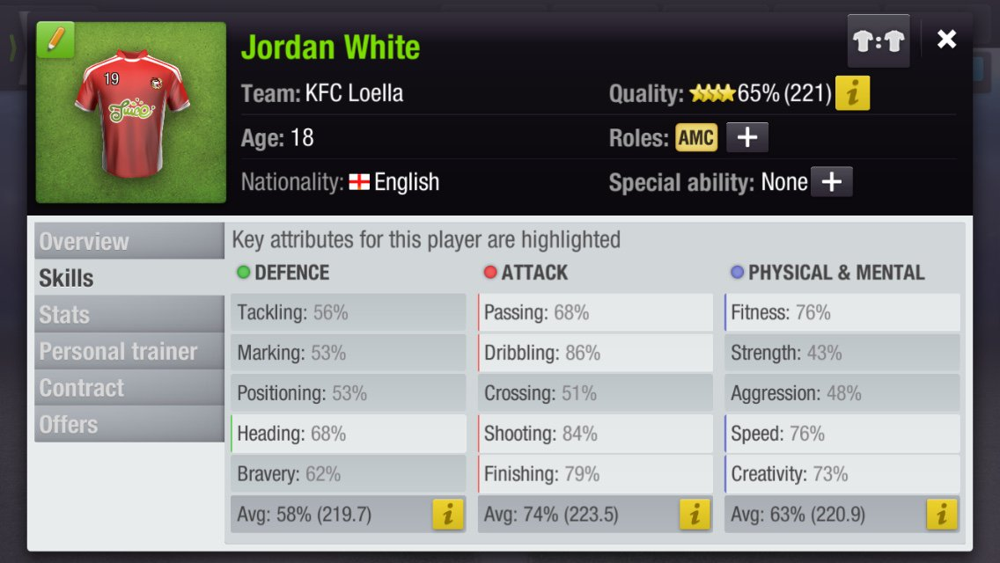
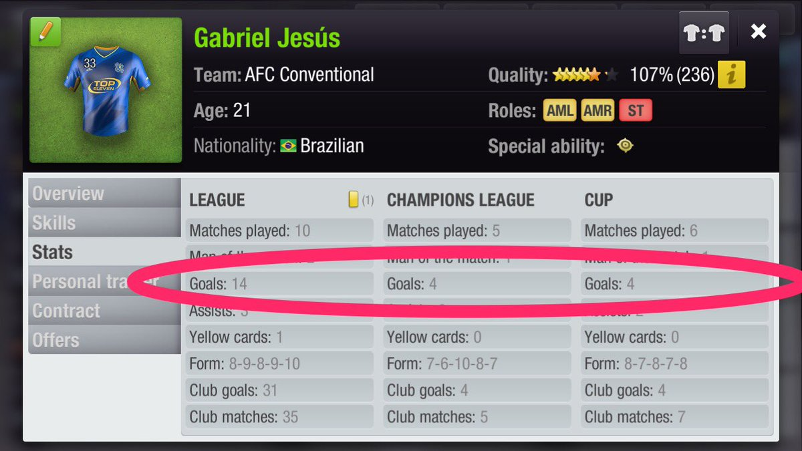

[The Literally Fantasy Sports Dev Bible](https://github.com/mharr171/The-Literally-Fantasy-Sports-Dev-Bible)
[The Literally Fantasy Sports Dev Bible](../README.html)

# Player Model

## Data

**General**

| Name | Datatype | Description |
|:--- |:---:| --- |
| name_first | string | Player's first name |
| name_last | string | Player's last name |
| age | integer | Player's age as a whole number |
| birth_day | float | Player's day of birth |
| birth_week | float | Player's week of birth |
| birth_year | float | Player's year of birth |

**Position**

| Name | Datatype | Description |
|:--- |:---:| --- |
| skill_play_side_center | integer | 0 - 100, grows and decays according to the GodBox |
| skill_play_side_left | integer | ^ |
| skill_play_side_right | integer | ^ |
| games_since_play_side_center | integer | Games since playing in a center position  |
| games_since_play_side_left | integer | Games since playing on the left side of the field |
| games_since_play_side_right | integer | Games since playing on the right side of the field |
| skill_play_position_striker | integer | 0 - 100, grows and decays according to the GodBox |
| skill_play_position_attacking_midfielder | integer | ^ |
| skill_play_position_midfielder | integer | ^ |
| skill_play_position_defensive_midfielder | integer | ^ |
| skill_play_position_defender | integer | ^ |
| skill_play_position_sweeper | integer | ^ |
| skill_play_position_goalkeeper | integer | ^ |
| games_since_play_position_striker | integer | How many games this player has played in the position  |
| games_since_play_position_attacking_midfielder | integer | ^ |
| games_since_play_position_midfielder | integer | ^ |
| games_since_play_position_defensive_midfielder | integer | ^ |
| games_since_play_position_defender | integer | ^ |
| games_since_play_position_sweeper | integer | ^ |
| games_since_play_position_goalkeeper | integer | ^ |

**Viewable Skills**

| Name | Datatype | Description |
|:--- |:---:| --- |
|  |  |  |

**Hidden Skills**

| Name | Datatype | Description |
|:--- |:---:| --- |
|  |  |  |

**Stats**

| Name | Datatype | Description |
|:--- |:---:| --- |
|  |  |  |

##  Relationships

<!-- 
```ruby
has_one :team
has_one :user, through: :team
has_one :tournament, through: :team
has_one :league, through: :team
``` -->

## Functions

User can...

+ Scout for New Players
+ Train a Player
+ Heal a Player
+ Trade a Player
+ Sell a Player

## Notes

**Skill vs Stat**

Skill is a player's ability to do a particular task. Stat is a count of an event.

**Reference Material**

*Son Heung Min Stats*

+ [FIFA19](https://www.fifaindex.com/player/200104/heung-min-son/)
+ [FM19](https://fmdataba.com/19/p/4592/son-heung-min/)
+ [PES19](https://www.pesmaster.com/son-heung-min/pes-2019/player/83929143/)

*Gianluigi Buffon Stats*

+ [FIFA19](https://www.fifaindex.com/player/1179/gianluigi-buffon/)
+ [FM19](https://fmdataba.com/19/p/8049/gianluigi-buffon/)
+ [PES19](https://www.pesmaster.com/g-buffon/pes-2019/player/983/)

*Images from Top Eleven Football Manager*






TODO: How to save past stats. keep current stats in player model? tournaments and leagues overlap? Create a competition_report model to house stats from a partifular tournament/league for a player?
